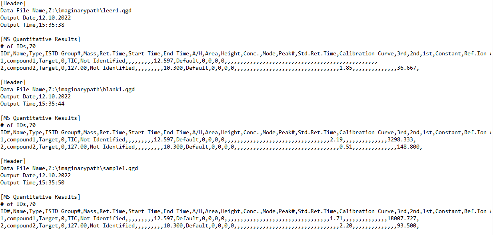
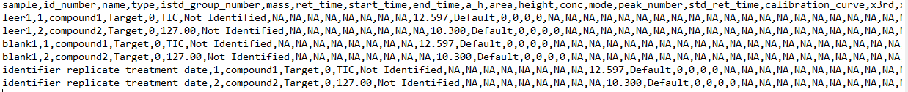

# README data

## Aim of the package

This is a small R-package which helps to quickly restructure the raw data output from the Shimadzu GCMSPostrun Analysis software.
The raw data structure unfortunately is not very friendly in regards of data analysis and therefore this script is supposed to reformat them in a way
to make data analysis easier.

## Original rawdata structure
    
The raw data output has the filename/sample written above the actual data and every individual sample is put below each sample.
Therefore, reading in the data is impossible as either the samplename is missing or all columns are considered as 1 as there are no header columns.
To check the file by yourself, you can check the "dummyfiles" folder, where it is stored.

## Restructured format
    
Now, the datafile has the sample written in the first column named "sample". If the samplename convention is well done,
treatment and further metainformation columns can be produced based on the sample name.
The example file is stored in "dummyfiles" if you want to check it yourself.

## Installation
can be easily installed using devtools::install_github("DoZi93/postrunner") in R.